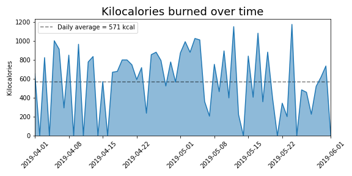
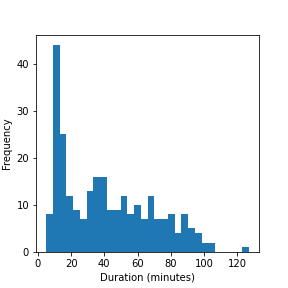
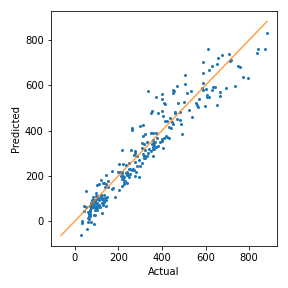
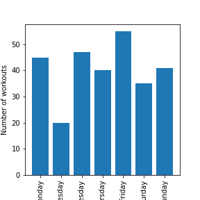

# Fitness Workload Regression

**A year of Polar watch exports — 283 workouts flattened from nested JSON — used to compare
strength against cardio physiology and to test whether a linear mixed model predicts calories
burned better than plain regression.**



---

## Why I built this

Fitness trackers export deeply nested JSON with heart-rate samples, GPS traces and device
metadata all interleaved. Turning that into an analysis-ready table is most of the work — and
doing it wrong silently corrupts every downstream number.

Once the data was clean, the real question:

> Can session duration and peak heart rate reliably predict energy expenditure — and does
> treating **activity type as a random effect** materially improve that prediction?

## At a glance

| | |
| --- | --- |
| **Workouts analysed** | 283 |
| **Activity types** | 6 |
| **Model RMSE improvement** | 79 → 61 |
| **Duration ↔ calories** | 0.92 |
| **Stack** | Python 3, statsmodels, SciPy, pandas, Matplotlib, Jupyter |

## Data

A personal Polar Flow export (`training-session-*.json`) covering roughly one year.

Handling decisions:

- GPS coordinates and ascent/descent dropped for **privacy** and irrelevance.
- Indoor sessions flagged by a `null` distance field, so treadmill and outdoor work separate cleanly.
- IQR filtering (`k = 1.5`) applied to duration, calories and 99th-percentile heart rate before modelling.

> Raw health data stays **private**. Reproduction requires exporting your own Polar Flow account.
> The model diagnostics summary produced by the run is in [`mdl_results.txt`](mdl_results.txt).

```bash
pip install -r requirements.txt
jupyter lab Polar.ipynb
```

## Method

1. **Flatten the JSON** — walk each nested export and pull `heartRateAvg2`, `heartRateStd` and the
   1/25/50/75/99th percentile heart rates into flat columns alongside sport, start/stop time and calories.
2. **Derive session features** — duration in minutes from start/stop timestamps, `isStrength` from
   the sport name, `isInside` from a null distance reading.
3. **Exploratory pass** — heart-rate histograms, a calorie time series with a daily average,
   intensity scatters, and hour-of-day / day-of-week bar charts.
4. **Model ladder** — baseline OLS on duration → per-sport OLS → OLS with 99th-percentile heart
   rate → a **linear mixed model** with a random slope for duration by activity type.
5. **Diagnostics** — VIF for multicollinearity, Goldfeld-Quandt for heteroscedasticity,
   Shapiro-Wilk and a Q-Q plot for residual normality, plus standardised residual plots.

## Key findings

| # | Finding | Evidence |
| --- | --- | --- |
| 1 | **A mixed model cuts error by 23%** | Modelling activity type as a random effect drops RMSE from **79 to 61** by absorbing the variance that strength sessions inject into a pooled regression |
| 2 | **Duration alone explains 85% of variance** | `kiloCalories ~ totalTime` reaches `R² = 0.85`, and the correlation between duration and calories is **0.92** |
| 3 | **Sport-specific fits diverge sharply** | Cycling reaches `R² = 0.98` and treadmill running `0.96`, while strength training sits at `0.44` — the same duration burns wildly different amounts depending on intensity |
| 4 | **Training follows a bimodal clock** | Workouts cluster at **12:00** and **20:00**, with no strong day-of-week preference across the full year |

### Model comparison

| Model | Specification | Result |
| --- | --- | --- |
| OLS | duration only | RMSE **79** · R² **0.85** |
| OLS | cycling | R² **0.98** |
| OLS | treadmill running | R² **0.96** |
| OLS | walking | R² **0.82** |
| OLS | strength training | R² **0.44** |
| **Linear mixed model** | random slope for duration by activity type | RMSE **61** — best overall |

## Charts

**Session duration distribution** — the input the baseline regression leans on:



**Predicted vs actual kilocalories for the fitted mixed model:**



**Workouts by day of week** — no strong preference, training is spread evenly:



## Limitations — stated plainly

- Running had only two sessions and was excluded; strength training's `R² = 0.44` points at high
  intra-session variance.
- Indoor sessions have no GPS or distance, so spatial analysis is impossible for them.
- The data is **one person's habits**, not a randomised sample of exercise types.
- The mixed model is fitted to a single user and would need recalibration for anyone else.
- IQR filtering may have removed legitimate high-intensity sessions along with true outliers.

## Next steps

- Collect data across multiple users to build a generalisable expenditure model.
- Promote Polar's heart-rate zone fields into intensity features.
- Validate predictions against published MET tables for external credibility.
- Forecast weekly calorie trends with Prophet and ship a Streamlit dashboard.

## License and attribution

Adapted from an MIT-licensed open-source analysis by **Sarvesh Kumar Sharma** —
`Copyright (c) 2020 Sarvesh Kumar Sharma`, MIT Licence. Documentation, model write-up and
charts in this repository were reworked and extended for this project. See [LICENSE](LICENSE).

---

**Muskan Choudhary** · [Portfolio case study](https://muskan-portfolio.vercel.app/projects/fitness-workload-regression) ·
[LinkedIn](https://www.linkedin.com/in/muskiee) · [GitHub](https://github.com/Heyymuskie)
